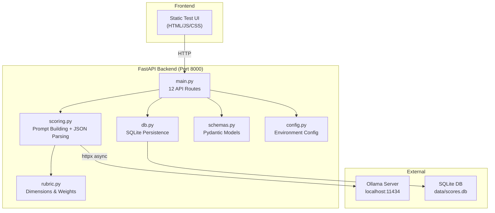
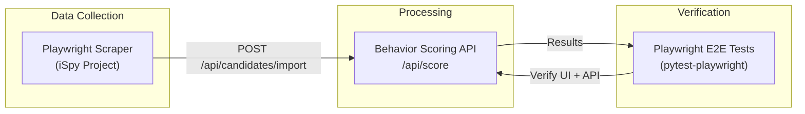
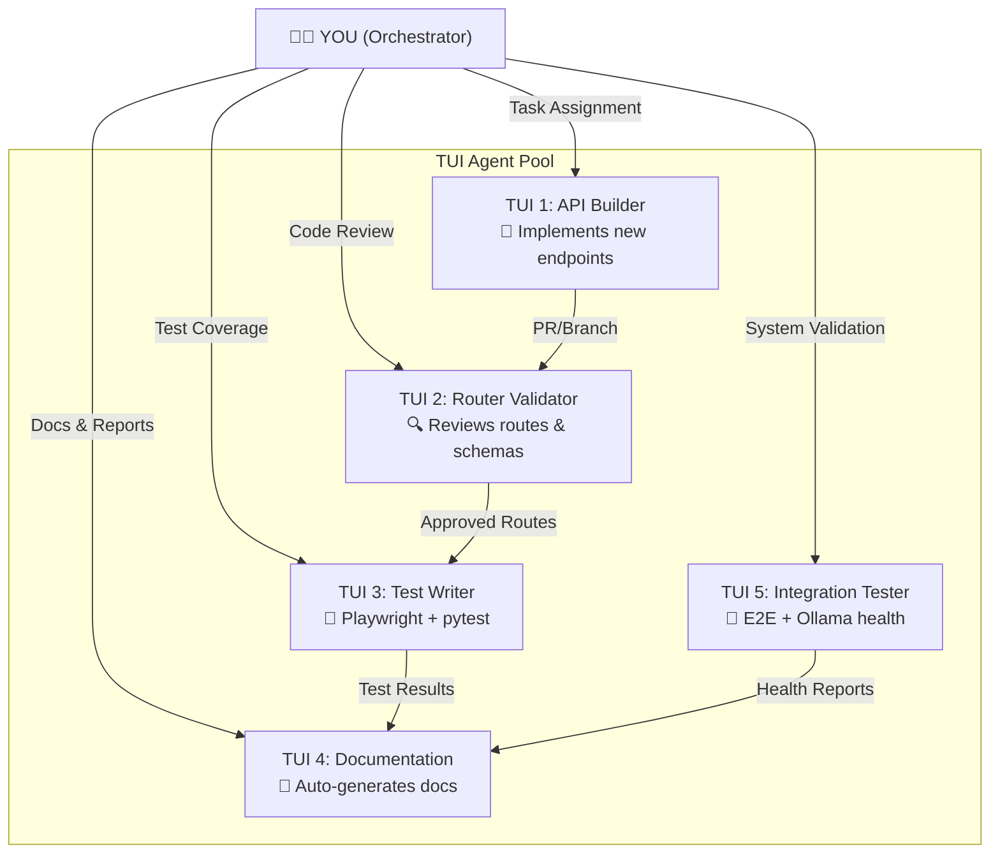
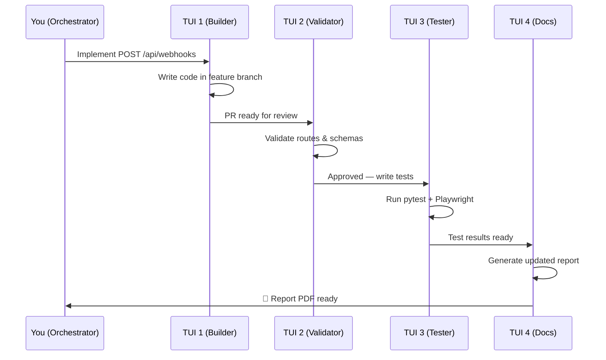

# Behavior Scoring — Project Report & Future Roadmap

> **Project**: Candidate Social Media Behavior Scoring Prototype  
> **Version**: 0.2.0  
> **Author**: Adrie (Internship — Semester Pendek)  
> **Date**: July 27, 2026  
> **Stack**: Python 3.11 · FastAPI · Ollama (Local LLM) · SQLite · Playwright (future)

---

## Table of Contents

1. [Project Overview](#1-project-overview)
2. [Current Architecture](#2-current-architecture)
3. [Implemented API Routes](#3-implemented-api-routes-current-state)
4. [Future APIs Worth Implementing](#4-future-apis-worth-implementing)
5. [Playwright Integration Strategy](#5-playwright-integration-strategy)
6. [TUI Agent Task Orchestration](#6-tui-agent-task-orchestration)
7. [TUI Agent Skills & Task Assignments](#7-tui-agent-skills--task-assignments)
8. [Personal Progress Checkpoints](#8-personal-progress-checkpoints)
9. [n8n Evaluation & Alternatives](#9-n8n-evaluation--alternatives)
10. [Workspace Improvement Recommendations](#10-workspace-improvement-recommendations)
11. [Auto-Report Generation Strategy](#11-auto-report-generation-strategy)

---

## 1. Project Overview

This is an **internal R&D prototype** that scores candidate social media text against a weighted rubric using a local LLM (Ollama). The system enforces fairness constraints (excluded attributes like religion, ethnicity, etc.) and requires human review for every score.

### Key Principles
- **Privacy-first**: All processing runs locally via Ollama — no data leaves the machine
- **Human-in-the-loop**: Every AI-generated score is tagged `pending` until a human reviewer approves/rejects it
- **Auditable**: Every run stores the rubric version, model used, raw model output, and a content hash of the rubric at scoring time

### Current Tech Stack

| Component | Technology | Purpose |
|-----------|-----------|---------|
| Backend | FastAPI 0.115.0 | REST API server |
| LLM Runtime | Ollama (qwen2.5:latest) | Local inference |
| Database | SQLite (data/scores.db) | Score persistence & audit trail |
| HTTP Client | httpx 0.27.2 | Async Ollama communication |
| Validation | Pydantic 2.9.2 | Schema enforcement |
| Frontend | Static HTML/JS/CSS | Test UI at `/` |
| Testing | pytest 8.3.3 + pytest-asyncio | Unit & integration tests |

---

## 2. Current Architecture



### Scoring Dimensions (Rubric v0.2.0)

| Dimension | Weight | Description |
|-----------|--------|-------------|
| Professional Consistency | 33% | CV-to-profile alignment |
| Communication Quality | 27% | Tone, clarity, professionalism |
| Domain Engagement | 27% | Field expertise evidence |
| Network Signal | 13% | Endorsements & connections (weakest signal) |
| Red Flag Screen | N/A | Pass/Review/Fail gate (not weighted) |

---

## 3. Implemented API Routes (Current State)

### ✅ System & Configuration

| # | Method | Endpoint | Purpose | Status |
|---|--------|----------|---------|--------|
| 1 | `GET` | `/api/health` | Backend + Ollama + model availability check | ✅ Done |
| 2 | `GET` | `/api/rubric` | Return active rubric (dimensions, weights, exclusions, version, hash) | ✅ Done |

### ✅ Core Scoring

| # | Method | Endpoint | Purpose | Status |
|---|--------|----------|---------|--------|
| 3 | `POST` | `/api/score` | Score a single candidate profile via Ollama | ✅ Done |
| 4 | `GET` | `/api/scores` | Paginated list with search, filters, sorting | ✅ Done |
| 5 | `GET` | `/api/scores/{id}` | Full detail of one score run | ✅ Done |
| 6 | `DELETE` | `/api/scores/{id}` | Delete a score run | ✅ Done |

### ✅ Batch & Comparison

| # | Method | Endpoint | Purpose | Status |
|---|--------|----------|---------|--------|
| 7 | `POST` | `/api/scores/batch` | Submit batch of profiles (background processing) | ✅ Done |
| 8 | `GET` | `/api/scores/batch/{batch_id}` | Poll batch job status/results | ✅ Done |
| 9 | `GET` | `/api/scores/compare?ids=1,2,5` | Side-by-side comparison with dimension averages | ✅ Done |

### ✅ Human Review & Analytics

| # | Method | Endpoint | Purpose | Status |
|---|--------|----------|---------|--------|
| 10 | `PATCH` | `/api/scores/{id}/review` | Update human review status & notes | ✅ Done |
| 11 | `GET` | `/api/scores/analytics` | Aggregated metrics, distributions, red flag counts | ✅ Done |
| 12 | `GET` | `/api/scores/export?format=csv\|json` | Export scored data as CSV or JSON download | ✅ Done |

> **Total implemented**: 12 API endpoints across 4 categories.

---

## 4. Future APIs Worth Implementing

> [!IMPORTANT]
> These are ranked by **impact vs. effort**. Priority 1 items deliver the most value for an internship scope.

### Priority 1 — High Impact, Moderate Effort

| # | API | Method & Route | Description | Why It's Worth It |
|---|-----|---------------|-------------|-------------------|
| F1 | **Webhook Notifications** | `POST /api/webhooks` | Register webhook URLs to receive scoring completion events | Enables n8n/Activepieces integration; the backbone of automation |
| F2 | **Authentication & API Keys** | `POST /api/auth/token` | JWT-based auth with API key management | Currently zero auth — critical for any multi-user or remote access |
| F3 | **Rubric Versioning API** | `POST /api/rubric/versions` | CRUD for rubric versions; A/B test different rubric configs | Lets you compare how different rubrics score the same candidate |
| F4 | **Candidate Data Ingestion** | `POST /api/candidates/import` | Bulk import from CSV/JSON with validation | Removes manual data entry; connects to external data sources |
| F5 | **Rate Limiting & Usage** | `GET /api/usage/stats` | Track API calls, token usage per model, response times | Self-monitoring; critical when using shared Ollama instances |

### Priority 2 — Medium Impact, Good Learning Value

| # | API | Method & Route | Description | Why It's Worth It |
|---|-----|---------------|-------------|-------------------|
| F6 | **Model Comparison API** | `POST /api/score/multi-model` | Score same profile with multiple models in parallel | Validates rubric consistency across LLMs |
| F7 | **Audit Log API** | `GET /api/audit/log` | Timestamped log of all actions (score, review, delete) | Compliance-ready; shows who did what and when |
| F8 | **Rubric Calibration API** | `POST /api/rubric/calibrate` | Run a "golden set" of known profiles and compare scores to expected | Automates rubric validation — currently manual |
| F9 | **Playwright Scraper Trigger** | `POST /api/scraper/trigger` | Trigger Playwright to collect public profile data, feed into scoring | Bridges your iSpy scraper with behavior-scoring |
| F10 | **Report Generation API** | `POST /api/reports/generate` | Generate PDF/HTML summary report for a candidate or batch | Automates the report you're creating right now |

### Priority 3 — Nice-to-Have, Advanced

| # | API | Method & Route | Description | Why It's Worth It |
|---|-----|---------------|-------------|-------------------|
| F11 | **Real-Time Scoring via WebSocket** | `WS /ws/score` | Stream scoring progress in real-time to frontend | Great UX; shows dimension-by-dimension scoring live |
| F12 | **External Data Enrichment** | `POST /api/enrich/{candidate_id}` | Enrich candidate data from People Data Labs / Apollo.io | Adds professional context beyond scraped text |
| F13 | **Sentiment Trend Analysis** | `GET /api/analysis/sentiment/{id}` | Track sentiment trends across a candidate's post history | Deeper behavioral insight beyond single-point scoring |
| F14 | **Inter-Rater Reliability** | `GET /api/reliability/scores` | Compare human review decisions vs. AI scores for consistency | Validates the entire system's fairness |

---

## 5. Playwright Integration Strategy

### Where Playwright Fits



### Two Playwright Use Cases

#### Use Case A: E2E API Testing (Immediate)
Use Playwright's `APIRequestContext` to test all 12+ endpoints:

```python
# Example: tests/e2e/test_scoring_flow.py
from playwright.sync_api import Playwright, APIRequestContext

def test_full_scoring_workflow(api_request_context):
    # 1. Check health
    health = api_request_context.get("/api/health")
    assert health.ok

    # 2. Submit score
    score = api_request_context.post("/api/score", data={
        "candidate_label": "e2e_test_001",
        "posts_sample": "I love building clean APIs..."
    })
    assert score.ok
    score_id = score.json()["id"]

    # 3. Verify it appears in list
    scores = api_request_context.get("/api/scores")
    assert any(s["id"] == score_id for s in scores.json()["results"])

    # 4. Human review
    review = api_request_context.patch(f"/api/scores/{score_id}/review", data={
        "status": "approved", "notes": "E2E test review"
    })
    assert review.json()["human_review"]["status"] == "approved"
```

#### Use Case B: Scraper-to-Scorer Pipeline (Future)
Bridge your existing `iSpy/scraper/x_scraper_repo` Playwright scraper to feed data into the scoring API automatically.

---

## 6. TUI Agent Task Orchestration

> [!TIP]
> The goal is to run **multiple AI agents in parallel**, each in its own terminal, working on separate API implementation tasks — without them conflicting.

### Recommended TUI Orchestration Tools

| Tool | Best For | Key Feature |
|------|----------|-------------|
| **TUICommander** | Multi-agent session management | Runs up to 50 concurrent sessions with activity dashboard |
| **Ralph TUI** | Autonomous task execution loops | Reads from PRD, handles errors, persists state |
| **Super Terminal** | Side-by-side isolated workspaces | Conflict detection + selective merge |
| **CrewAI** | Role-based agent teams (code) | Define agents with specific roles, tools, and goals |

### Recommended Architecture: 5-Agent Setup



---

## 7. TUI Agent Skills & Task Assignments

### TUI 1 — API Builder Agent 🔧

**Role**: Implements new API endpoints in `app/main.py`, schemas in `app/schemas.py`, and database functions in `app/db.py`.

**Skills**:
- FastAPI route creation (GET, POST, PATCH, DELETE, WebSocket)
- Pydantic schema design
- SQLite migration writing
- Ollama prompt engineering

**Task Queue**:

| Task ID | API to Implement | Files to Modify | Priority |
|---------|-----------------|-----------------|----------|
| T1.1 | `POST /api/webhooks` (Webhook Registration) | main.py, schemas.py, db.py | 🔴 High |
| T1.2 | `POST /api/auth/token` (JWT Auth) | main.py, schemas.py, config.py | 🔴 High |
| T1.3 | `POST /api/rubric/versions` (Rubric CRUD) | main.py, rubric.py, db.py | 🟡 Med |
| T1.4 | `POST /api/candidates/import` (Bulk Import) | main.py, schemas.py, db.py | 🟡 Med |
| T1.5 | `GET /api/usage/stats` (Usage Tracking) | main.py, new: usage.py | 🟢 Low |
| T1.6 | `POST /api/score/multi-model` (Multi-Model) | main.py, scoring.py, ollama_client.py | 🟢 Low |

**Prompt Template for TUI 1**:
```
You are the API Builder agent. Your job is to implement the following API endpoint:
- Route: POST /api/webhooks
- Purpose: Register webhook URLs for scoring completion events
- Files to modify: app/main.py, app/schemas.py, app/db.py
- Constraints: Follow existing code style, use Pydantic models, add proper error handling
- Branch: feature/webhook-api
Do NOT modify test files. Do NOT modify existing endpoints.
```

---

### TUI 2 — Router Validator Agent 🔍

**Role**: Reviews all routes for correctness, security, schema consistency, and API design best practices.

**Skills**:
- FastAPI middleware analysis
- OpenAPI spec validation
- Security audit (CORS, auth, input validation)
- Pydantic schema consistency checks

**Task Queue**:

| Task ID | Validation Task | What to Check |
|---------|----------------|---------------|
| T2.1 | Review route naming conventions | RESTful compliance, consistent pluralization |
| T2.2 | Check all response schemas | Every endpoint returns a Pydantic model |
| T2.3 | Validate error handling | All routes handle 400, 404, 500 properly |
| T2.4 | Security review | CORS config, input sanitization, SQL injection |
| T2.5 | OpenAPI spec completeness | Swagger docs have descriptions for all params |
| T2.6 | Review new endpoints from TUI 1 | Code review + approval gate |

**Prompt Template for TUI 2**:
```
You are the Router Validator agent. Review the following file for API quality:
- File: app/main.py
- Check: All routes have proper HTTP status codes, Pydantic response models,
  descriptive docstrings, and consistent error handling.
- Output: A validation report with PASS/FAIL for each endpoint and specific
  line-level suggestions.
Do NOT make code changes. Only produce a review report.
```

---

### TUI 3 — Test Writer Agent 🧪

**Role**: Writes and maintains pytest + Playwright test suites for every API endpoint.

**Skills**:
- pytest fixtures and parametrization
- Playwright `APIRequestContext` for API testing
- Playwright browser automation for E2E UI testing
- Mock/stub patterns for Ollama

**Task Queue**:

| Task ID | Test to Write | Type | Target |
|---------|--------------|------|--------|
| T3.1 | Health endpoint tests | Unit | test_health.py |
| T3.2 | Scoring pipeline E2E | Integration | test_scoring_e2e.py |
| T3.3 | Batch scoring edge cases | Unit | test_batch.py |
| T3.4 | Human review workflow | E2E | test_review_flow.py |
| T3.5 | Export CSV/JSON validation | Unit | test_export.py |
| T3.6 | Playwright UI flow tests | E2E | test_ui_e2e.py |

**Prompt Template for TUI 3**:
```
You are the Test Writer agent. Write comprehensive pytest tests for:
- Endpoint: POST /api/score
- Test file: tests/test_scoring_api.py
- Requirements: Mock Ollama responses, test happy path + error cases
  (invalid input, Ollama down, malformed JSON), verify DB persistence.
- Use pytest-asyncio for async tests. Use Playwright APIRequestContext
  for integration tests.
Do NOT modify source code. Only create/modify test files.
```

---

### TUI 4 — Documentation Agent 📝

**Role**: Auto-generates and maintains project documentation, changelogs, and reports.

**Skills**:
- Markdown documentation generation
- OpenAPI/Swagger spec parsing
- Changelog maintenance
- PDF report generation (via markdown-pdf or weasyprint)

**Task Queue**:

| Task ID | Documentation Task | Output |
|---------|--------------------|--------|
| T4.1 | Generate API reference from code | docs/api_reference.md |
| T4.2 | Update README with new endpoints | README.md |
| T4.3 | Create deployment guide | docs/deployment.md |
| T4.4 | Generate test coverage report | docs/test_coverage.md |
| T4.5 | Create architecture diagram | docs/architecture.md |
| T4.6 | Build final PDF report | reports/final_report.pdf |

---

### TUI 5 — Integration Tester Agent 🔗

**Role**: Runs full system integration tests, monitors Ollama health, validates the pipeline end-to-end.

**Skills**:
- System health monitoring
- Ollama model verification
- Database integrity checks
- Performance benchmarking

**Task Queue**:

| Task ID | Integration Task | What to Verify |
|---------|-----------------|----------------|
| T5.1 | Ollama connectivity test | Model pulled, responding, correct format |
| T5.2 | Full scoring pipeline | Input → Ollama → Parse → DB → API response |
| T5.3 | Concurrent batch stress test | 10 profiles simultaneously |
| T5.4 | Database migration test | Schema matches expectations after init_db() |
| T5.5 | Export data integrity | CSV/JSON export matches DB content |

---

## 8. Personal Progress Checkpoints

> [!NOTE]
> Use these checkpoints as your personal tracker. Check off items as you complete them.

### Phase 1: Foundation (Week 1-2)
- [ ] Verify all 12 existing APIs work correctly
- [ ] Set up Playwright for API testing (`pip install pytest-playwright`)
- [ ] Write basic E2E tests for existing endpoints (TUI 3 tasks T3.1-T3.3)
- [ ] Review and fix any router issues (TUI 2 tasks T2.1-T2.4)
- [ ] Choose TUI orchestrator tool (TUICommander or Ralph TUI)

### Phase 2: Core New APIs (Week 3-4)
- [ ] Implement Webhook API — `POST /api/webhooks` (F1)
- [ ] Implement Auth/API Key system — `POST /api/auth/token` (F2)
- [ ] Implement Candidate Import — `POST /api/candidates/import` (F4)
- [ ] Write tests for all new endpoints
- [ ] Router validation review for new endpoints

### Phase 3: Advanced APIs + Integration (Week 5-6)
- [ ] Implement Rubric Versioning — `POST /api/rubric/versions` (F3)
- [ ] Implement Usage Stats — `GET /api/usage/stats` (F5)
- [ ] Implement Report Generation — `POST /api/reports/generate` (F10)
- [ ] Bridge Playwright scraper (iSpy) with scoring API (F9)
- [ ] Set up workflow automation (n8n or Activepieces)

### Phase 4: Polish & Report (Week 7-8)
- [ ] Implement Multi-Model comparison (F6)
- [ ] Implement Audit Log (F7)
- [ ] Full E2E test suite with Playwright
- [ ] Generate final PDF documentation report
- [ ] Demo preparation

---

## 9. n8n Evaluation & Alternatives

### Is n8n Good for Your Workspace?

> **Short answer: Yes, n8n is a good fit, but there are better alternatives depending on your needs.**

#### n8n Pros for This Project
- ✅ Self-hosted (data stays local — aligns with your privacy-first design)
- ✅ Visual workflow builder — easy to connect scoring API with webhooks
- ✅ Native AI/LangChain nodes for LLM orchestration
- ✅ Can trigger Playwright scrapers and scoring pipelines visually
- ✅ Free for self-hosted internal use

#### n8n Cons
- ⚠️ "Fair-code" license — restrictions on commercial redistribution
- ⚠️ Node.js runtime adds another dependency to your Python stack
- ⚠️ Can be heavy for simple webhook-to-API flows
- ⚠️ Limited Python scripting (code nodes use JavaScript by default)

### Recommended Alternatives

| Tool | License | Best For Your Case | Python-Friendly | Self-Hosted |
|------|---------|-------------------|-----------------|-------------|
| **Activepieces** | MIT (true open source) | Closest n8n replacement, cleaner UI, MCP toolkit | 🟡 Limited | ✅ Yes |
| **Windmill** ⭐ | AGPLv3 | **Best for you** — code-first (Python/TS), auto-generates UIs from scripts | ✅ Excellent | ✅ Yes |
| **Kestra** | Apache 2.0 | YAML workflows, high-scale orchestration | ✅ Good | ✅ Yes |
| **Prefect** | Apache 2.0 | Python-native workflow orchestration, great for data pipelines | ✅ Native | ✅ Yes |
| **Temporal** | MIT | Durable execution, fault-tolerant workflows | ✅ Good SDK | ✅ Yes |

> [!TIP]
> **My recommendation: Use Windmill** for your API workspace. It's code-first (you write Python, not drag nodes), self-hosted, and automatically generates UIs from your scripts. Since your entire stack is Python, Windmill feels native rather than bolted-on. If you prefer visual workflows, go with **Activepieces** (MIT license, no restrictions).

### Quick Decision Matrix

```
Need visual drag-and-drop?     → Activepieces
Need code-first Python?         → Windmill ⭐
Need high-scale orchestration?  → Kestra
Already invested in n8n?        → Keep n8n (it works fine)
Need simplest possible setup?   → Prefect (pip install prefect)
```

---

## 10. Workspace Improvement Recommendations

### Tools You Should Add

| Category | Tool | Why |
|----------|------|-----|
| **API Testing** | Playwright (Python) | E2E + API testing in one tool |
| **API Documentation** | Swagger UI (built into FastAPI at `/docs`) | Already there — leverage it more |
| **API Mocking** | Prism (Stoplight) | Mock your APIs before implementing them |
| **Environment Management** | uv | Already using it — keep it as your Python package manager |
| **Git Workflow** | git worktree | Isolate agent work into separate branches/directories |
| **Workflow Automation** | Windmill or Activepieces | Orchestrate scraper → scorer → report pipeline |
| **Monitoring** | Prometheus + Grafana (lightweight) | Track API response times, Ollama latency |
| **Secret Management** | python-dotenv (already using) + 1Password CLI | Better than plain `.env` for sensitive keys |

### Workspace Structure Improvement

```
behavior-scoring/
├── app/                        # ✅ Existing — backend code
├── static/                     # ✅ Existing — test UI
├── tests/                      # ✅ Existing — expand with Playwright
│   ├── unit/                   # 🆕 Unit tests (mocked Ollama)
│   ├── integration/            # 🆕 API integration tests
│   └── e2e/                    # 🆕 Playwright E2E tests
├── docs/                       # 🆕 Generated documentation
│   ├── api_reference.md
│   ├── architecture.md
│   └── deployment.md
├── reports/                    # 🆕 Auto-generated reports
├── scripts/                    # 🆕 Automation scripts
│   ├── setup_windows.ps1       # One-click setup for Windows
│   └── run_all_tests.ps1       # Test runner script
├── workflows/                  # 🆕 Windmill/n8n workflow definitions
├── sample_data/                # ✅ Existing
├── data/                       # ✅ Existing — SQLite DB
├── .github/                    # ✅ Existing — CI/CD
├── requirements.txt            # ✅ Existing
├── requirements-dev.txt        # 🆕 Dev dependencies (playwright, etc.)
└── pyproject.toml              # 🆕 Modern Python project config
```

---

## 11. Auto-Report Generation Strategy

After each TUI agent completes its work, trigger automatic report generation:



### Report Auto-Generation Script

```python
# scripts/generate_report.py
"""
Run after each task completion to generate an updated PDF report.
Uses markdown-pdf or weasyprint to convert markdown → PDF.
"""
import subprocess
import datetime

def generate_report():
    timestamp = datetime.datetime.now().strftime("%Y%m%d_%H%M")
    input_file = "docs/project_report.md"
    output_file = f"reports/behavior_scoring_report_{timestamp}.pdf"

    # Option 1: Using markdown-pdf (npm)
    subprocess.run(["npx", "markdown-pdf", input_file, "-o", output_file])

    # Option 2: Using Python (weasyprint)
    # from weasyprint import HTML
    # import markdown
    # html = markdown.markdown(open(input_file).read(), extensions=['tables', 'fenced_code'])
    # HTML(string=html).write_pdf(output_file)

    print(f"Report generated: {output_file}")

if __name__ == "__main__":
    generate_report()
```

---

## Appendix A: Existing File Map

| File | Lines | Purpose |
|------|-------|---------|
| `app/main.py` | 365 | 12 API endpoints + CORS + static mount |
| `app/scoring.py` | 287 | Prompt building, JSON parsing, composite score |
| `app/db.py` | 335 | SQLite CRUD, migrations, analytics queries |
| `app/schemas.py` | 164 | Pydantic models for all request/response types |
| `app/rubric.py` | 139 | Rubric dimensions, weights, hash function |
| `app/config.py` | 66 | Environment configuration via dotenv |
| `app/ollama_client.py` | 91 | Async Ollama HTTP client |
| `static/app.js` | ~43K | Frontend JavaScript |
| `static/index.html` | ~20K | Frontend HTML |
| `static/style.css` | ~38K | Frontend CSS |
| `tests/test_scoring.py` | ~6K | Scoring pipeline tests (mocked Ollama) |
| `tests/test_rubric.py` | ~1K | Rubric weight validation |
| `tests/test_backend_features.py` | ~7K | Backend feature tests |

## Appendix B: Quick Reference Commands

```powershell
# Start backend
venv\Scripts\python.exe -m uvicorn app.main:app --host 127.0.0.1 --port 8000

# Run tests
venv\Scripts\python.exe -m pytest

# Check Ollama
ollama list

# Install Playwright for testing
pip install pytest-playwright
playwright install

# Generate PDF report (after setting up markdown-pdf)
npx markdown-pdf docs/project_report.md -o reports/report.pdf
```

---

> **Next Step**: Review this document, approve the API priorities, and choose your TUI orchestrator. Then we begin Phase 1 — setting up the test infrastructure and running TUI agents in parallel.
