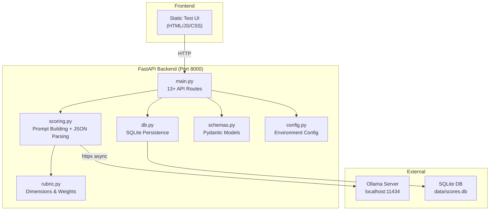

# Behavior Scoring — Project Implementation & Roadmap Report

> **Project**: Candidate Social Media Behavior Scoring Prototype  
> **Version**: 0.2.0  
> **Author**: Adrie (Internship — Semester Pendek)  
> **Date**: July 27, 2026  
> **Stack**: Python 3.11 · FastAPI · Ollama (Local LLM) · SQLite · Playwright

---

## 1. Project Overview

This is an **internal R&D prototype** that scores candidate social media text against a weighted rubric using a local LLM (Ollama). The system enforces fairness constraints (excluded attributes like religion, ethnicity, etc.) and requires human review for every score.

### Key Principles
- **Privacy-first**: All processing runs locally via Ollama — no data leaves the machine.
- **Human-in-the-loop**: Every AI-generated score is tagged `pending` until a human reviewer approves/rejects it.
- **Auditable**: Every run stores the rubric version, model used, raw model output, and a content hash of the rubric at scoring time.

### Current Tech Stack

| Component | Technology | Purpose |
|-----------|-----------|---------|
| Backend | FastAPI 0.115.0 | REST API server |
| LLM Runtime | Ollama (qwen2.5:latest) | Local inference |
| Database | SQLite (`data/scores.db`) | Score persistence & audit trail |
| HTTP Client | `httpx` 0.27.2 | Async Ollama communication |
| Validation | Pydantic 2.9.2 | Schema enforcement |
| Frontend | Static HTML/JS/CSS | Test UI at `/` |
| Testing | pytest 8.3.3 + Playwright | Unit, integration & E2E API tests |

---

## 2. Architecture & Delivered Functionality

### Scoring Dimensions (Rubric v0.2.0)

| Dimension | Weight | Description |
|-----------|--------|-------------|
| Professional Consistency | 33% | CV-to-profile alignment |
| Communication Quality | 27% | Tone, clarity, professionalism |
| Domain Engagement | 27% | Field expertise evidence |
| Network Signal | 13% | Endorsements & connections (weakest signal) |
| Red Flag Screen | N/A | Pass/Review/Fail gate (not weighted) |

---

## 3. Implemented API Routes

### System & Discovery
- `GET /api/health` — Backend + Ollama + model availability check.
- `GET /api/rubric` — Return active rubric (dimensions, weights, exclusions, version, hash).

### Core Scoring & Management
- `POST /api/score` — Score a single candidate profile via Ollama.
- `GET /api/scores` — Paginated list with search, filters, sorting.
- `GET /api/scores/{id}` — Full detail of one score run.
- `DELETE /api/scores/{id}` — Delete a score run.
- `POST /api/webhooks` — Register webhooks for scoring completion events.

### Batch & Analytics
- `POST /api/scores/batch` — Submit batch of profiles (background processing).
- `GET /api/scores/batch/{batch_id}` — Poll batch job status/results.
- `GET /api/scores/compare?ids=1,2,5` — Side-by-side comparison with dimension averages.
- `GET /api/scores/analytics` — Aggregated metrics, distributions, red flag counts.
- `GET /api/scores/export?format=csv|json` — Export scored data as CSV or JSON download.

### Human Review
- `PATCH /api/scores/{id}/review` — Update human review status & notes.

---

## 4. Documentation & Reporting Tools

- `docs/api_reference.md` — Full API contract and schema documentation.
- `docs/opencode_multi_agent_guide.md` — Guide for orchestrating multiple OpenCode TUI instances via Git worktrees.
- `scripts/generate_pdf_report.py` — Native Python script for generating PDF reports.

---

## 5. Next Planned Priorities

1. **Rubric Versioning** (`POST /api/rubric/versions`)
2. **Usage Statistics** (`GET /api/usage/stats`)
3. **Report Generation** (`POST /api/reports/generate`)
4. **Scraper-to-Scoring Integration** (connecting approved scraper output to the scoring workflow)
5. **Workflow Automation** (Windmill / Activepieces)
