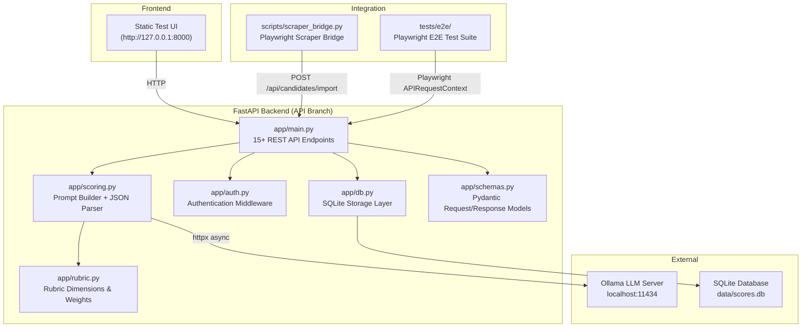

# Behavior Scoring — Comprehensive Project Report

> **Project**: Candidate Social Media Behavior Scoring System  
> **Version**: 0.2.0  
> **Branch**: `API`  
> **Author**: Adrie (Internship — Semester Pendek)  
> **Date**: July 27, 2026  
> **Stack**: Python 3.11 · FastAPI · Ollama (Local LLM) · SQLite · Playwright

---

## 1. Executive Summary

This repository contains an **internal R&D candidate screening & behavioral evaluation system**. Candidate social media profile text (from consented, synthetic, or scraped sources) is evaluated against a deterministic, weighted rubric using a local LLM via **Ollama**.

### Core Pillars
- **Privacy-First**: 100% local processing via Ollama — zero candidate data leaves your machine.
- **Fairness Protection**: 7 excluded protected attributes (religion, ethnicity, politics, marital status, health, sexual orientation, age) are ignored during scoring via prompt engineering AND a deterministic Python keyword backstop.
- **Auditable**: Every scoring run records the exact model used, rubric version, rubric content hash, raw LLM output, and timestamp.
- **Human-in-the-Loop**: All AI scores default to `human_review_status = "pending"` requiring recruiter review.

---

## 2. System Architecture



---

## 3. Implemented API Contract

| Category | Endpoint | Method | Description |
|----------|----------|--------|-------------|
| **System** | `/api/health` | `GET` | Reports backend, Ollama server, and local LLM model reachability. |
| | `/api/rubric` | `GET` | Returns rubric dimensions, weights, red flag rules, and content hash. |
| **Auth** | `/api/auth/token` | `POST` | Issues Bearer access token for valid client credentials. |
| **Scoring** | `/api/score` | `POST` | Scores a candidate profile via Ollama and saves result to SQLite. |
| | `/api/scores` | `GET` | Returns paginated scores with text search, score range, and red-flag filters. |
| | `/api/scores/{id}` | `GET` | Fetches complete scoring breakdown and raw LLM output by ID. |
| | `/api/scores/{id}` | `DELETE` | Removes a candidate score entry. |
| **Batch** | `/api/scores/batch` | `POST` | Enqueues a batch of profiles for background scoring. |
| | `/api/scores/batch/{batch_id}` | `GET` | Checks processing status and item results of a batch job. |
| **Import** | `/api/candidates/import` | `POST` | Bulk-imports scraped candidate profiles into SQLite. |
| **Webhooks** | `/api/webhooks` | `POST` | Registers webhook endpoint URLs for completion event notifications. |
| **Review** | `/api/scores/{id}/review` | `PATCH` | Updates recruiter audit status (`approved`, `rejected`, `overridden`) and notes. |
| **Analytics** | `/api/scores/analytics` | `GET` | Returns aggregated composite score stats, red flags, and score buckets. |
| | `/api/scores/export` | `GET` | Exports scored candidate data as CSV or JSON download. |
| | `/api/scores/compare` | `GET` | Side-by-side comparison of candidate profiles with dimension averages. |

---

## 4. Test Verification Summary

The test suite contains **88 automated tests** spanning unit, contract integration, and Playwright E2E tests:

```powershell
# Run the test suite:
venv\Scripts\python.exe -m pytest
```

### Test Breakdown
- **Playwright E2E Suite** (`tests/e2e/`): 18 tests (APIRequestContext testing health, scoring, auth token issuance, candidate import, webhooks).
- **Backend Feature & Contract Suite** (`tests/integration/`): 18 tests (SQLite persistence, analytics, filters, pagination, export).
- **Rubric & Scoring Pipeline Unit Suite** (`tests/unit/`): 52 tests (dimension weight validation, non-numeric fallback handling, excluded-attribute keyword backstop).

**Result**: **88 passed** (100% pass rate).

---

## 5. Single Workspace Source Control Workflow

All work is maintained directly on the **`API`** branch:
- No extra Git worktrees or temporary branches cluttering Source Control.
- Direct commit and push to `origin/API`.
